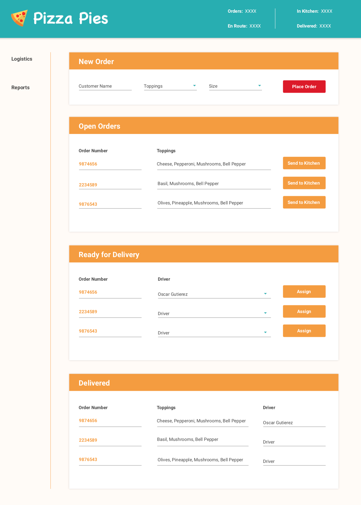

# NgAssessment

This project is designed to assess the technical ability of a developer in regards to their Angular skill set.

Set aside 90, focused minutes, to be able to complete this work. It is important that this is done in a timebox.
This is based on the honor system, so please keep the time to no more than 90 minutes. This will help give
a more accurate assessment.

This goal of this assessment is to find out how you approach solving problems from an Anguler perspective.

It is recommended that you spend 10 minutes thinking about how you would solve this problem and layout
the application. 

## Approach
A recommendation is to create the structure of the application and note how everything is 
interconnected by using `// TODO:` comments. This will allow you to deliver a complete theoretical solution.
After that is complete, start implementing the functionality.

It is unlikely that a complete, bug-free solution will be delivered within the given time frame. We are 
looking for the Angular problem solving skills versus 100% functioning and bug-free code.

## Standards
Follow the Angular standards set forth the in the [Angular Style Guide](https://angular.io/guide/styleguide)

Additional standards that are advisable to follow:
+ All variables must be typed.
+ Do not type variables with `any`.
+ Include access modifiers for **ALL** member variables (does not include `@Input, @Output, @ViewChild, etc.)

+ Include an access modifier and return type for **ALL** functions.

+ Create meaningful names for steam objects.
    + Avoid using `$` to suffix stream names.

## Submitting your solution
The process to submit the solution should be from a pull request from a fork.

+ Create a fork on Bitbucket.
+ Clone the forked repository your local system.
+ Modify the local repository.
+ Run TsLint on your code using the command `npm run build:solution`
+ Commit your changes.
+ Push changes back to the remote fork on Bitbucket.
+ Create a pull request from the forked repository (source) back to the original (destination).

## Running the dev environment

The project is configured to use a mock API server. Data is not configured to persist and will be reset 
when `json-server`is restarted.

Use the following command to start the application with the mock server running in the background.

`npm run start:dev:mock`

## Goals
These goals are listed in priority order.
+ Create the the different cards for each section of the Logistics page
    + Use `mat-card` for the item
+ Implement the *New Order* section
    + The order must call the API to persist the data. Data should be available when the application is restarted
    + Customer name should accept alpha-numeric input only.
    + Toppings is a multi-select control.
    + Size is a single select control.
    + Upon placing the order, it should appear in the *Open Orders* in real-time.
    + Change the status of the order to `New`.
+ Implement *Open Orders* section
    + Display the open order information.
    + Use the `mdTruncate` directive for when the toppings overflow the label
    + Send to kitchen simulates the cooking of a pizza.
        + Pizzas take at least 5s to cook for no toppings
        + Calculate the rest of the time based on the time variable for the toppings. E.g. pepperoni adds an extra 2s to the cooking time.
        + Change the status of the order to `ReadyForDelivery`.
        + Persist the information to the API.
+Implement *Ready for Delivery* section
    + Each pizza takes 15s to be delivered.
    + Pizzas may be queued for the same driver.
    + Pizzas are delivered one at a time.
    + Changed the status of the order to `Delivered` once the delivery is complete.
    + Persist the information to the API.
    
## Stretch Goals

+ Complete the following Unit Tests. The following unit tests would be sufficient to show the understanding of the conept.
    + Open Orders functionality
        + The data elements in the DOM match the data coming from the typescript class
        + The API is called with the correct payload.
        
+ Styling
    + Update the default Angular Material theme to do change the colors to match the mockup.
    
## Mockup

## UML

